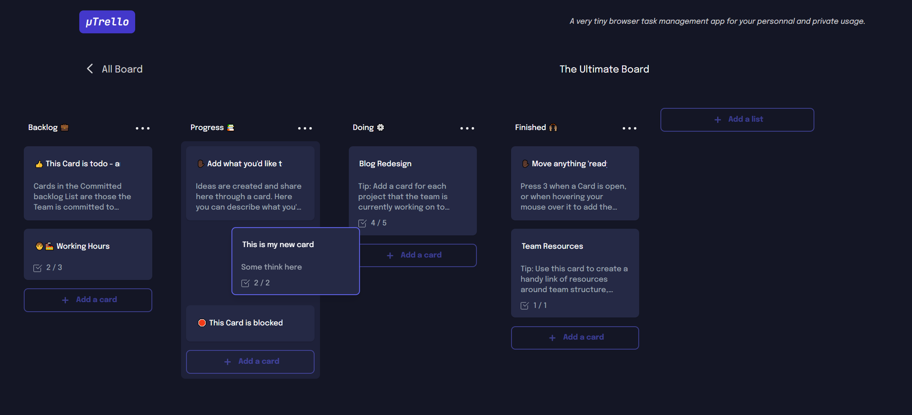

# µTrello - Fusion of Keep and Trello

µTrello is a very tiny browser task management app for your personnal and private usage.

Check the chrome extension here.

Thank you for trying it. Don't forgert the 6 stars reviews.

### Built with

- [Typescript](https://www.typescriptlang.org/) -  Syntactical superset of JavaScript 
- [React](https://reactjs.org/) - Javascript Library
- [Next.js](https://nextjs.org/) - React Framework 
- [TailwindCSS](https://tailwindcss.com/) - Utility-first CSS framework
- [Dexie.js](https://dexie.org/) - A Minimalistic Wrapper for IndexedDB
- [React-beautiful-dnd](https://github.com/atlassian/react-beautiful-dnd) - Beautiful and accessible drag and drop for lists with React 
- [ESLint](https://eslint.org/) - Pluggable JavaScript linter

## Author

- Website - [Moussa Mamadou](http://www.moussamamadou.com)
- Frontend Mentor - [@moussamamadou](https://www.frontendmentor.io/profile/moussamamadou)

